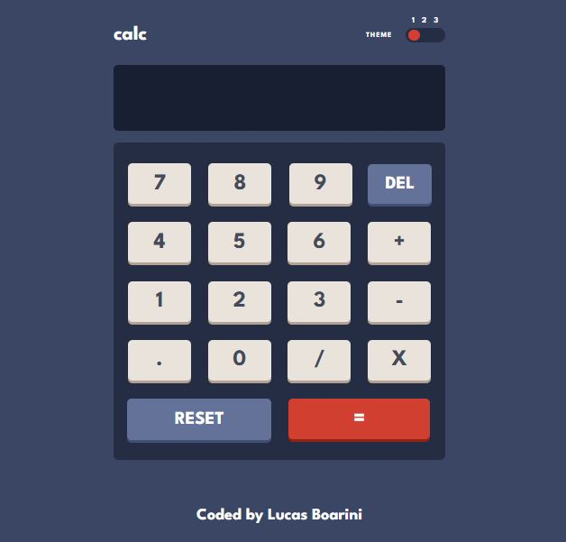

# Calculator App

Nesse projeto irei desenvolver uma calculadora, meu objetivo com esse projeto é continuar na melhoria com a estruturação de HTML e CSS, e também buscando melhorias no JavaScript.

## Menu

- [O que aprendi](#o-que-aprendi)
- [Meu Processo](#meu-peocesso)
- [Screenshot](#screenshot)
- [Link](#link)
- [Construido com](#construido-com)
- [Contatos](#contatos)

### O que aprendi

### Meu Processo

Desenvolvi esse projeto realizando as seguintes etapas:

- [ ] Montar estrutura básica da calculadora;
- [ ] Estilizar design da calculadora;
- [ ] Criar funções para as operações matemáticas;

### Screenshot

Abaixo estou deixando um screenshot do design final do projeto conforme desenvolvi:

### Link

### Construido com

As tecnologias utilizadas para esse projeto são as listadas abaixo:

- Semantic HTML5 markup
- CSS custom properties
- JavaScript

### Contatos

[LinkedIn](https://www.linkedin.com/in/lucas-boarini)

